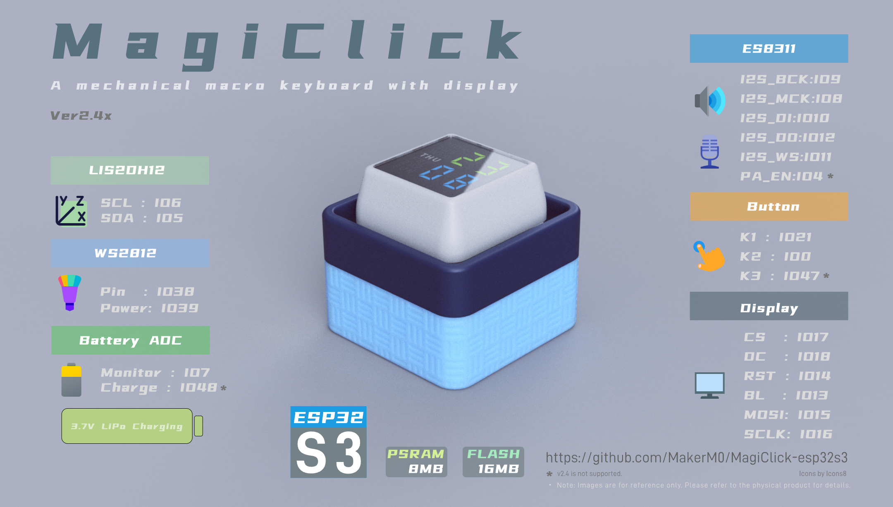
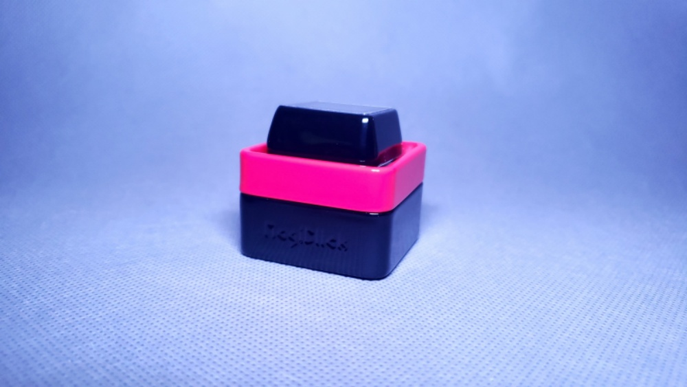
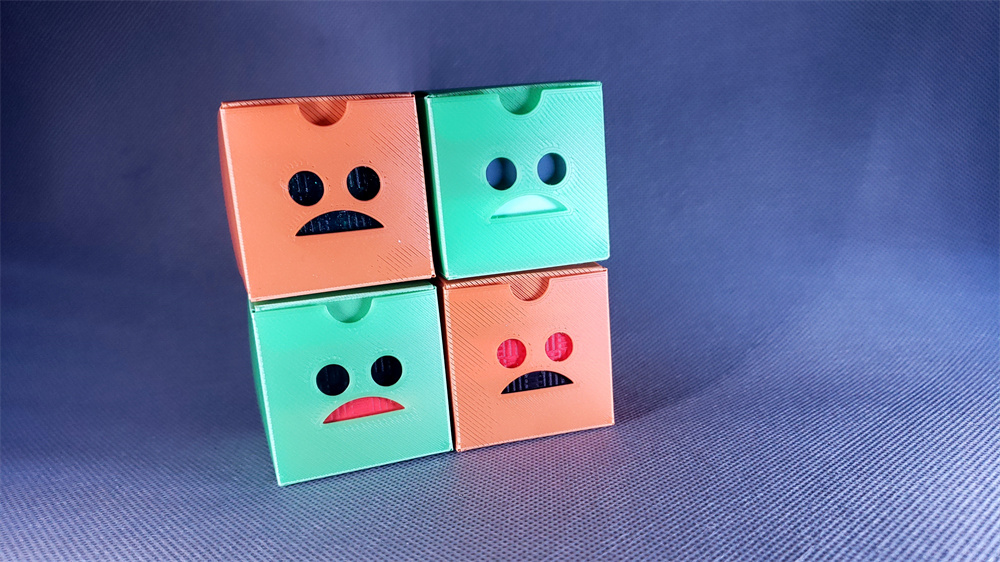
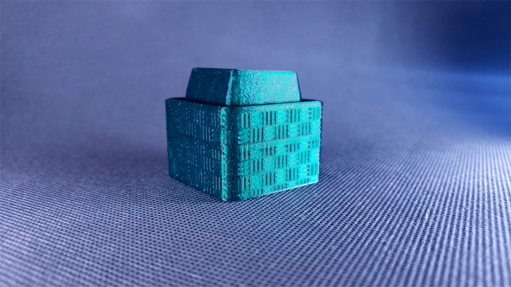
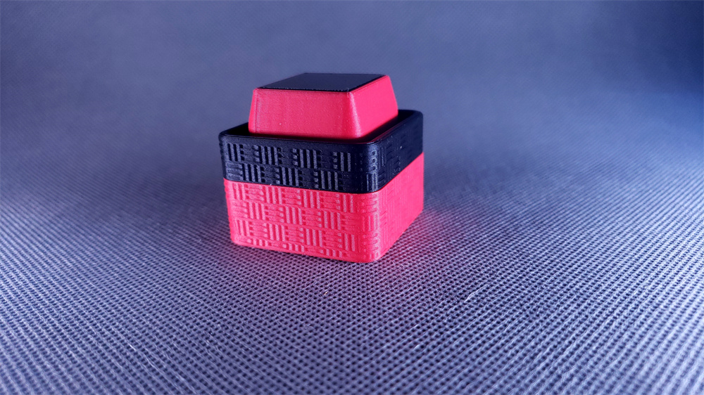

     
    
     

   
    
      

https://github.com/user-attachments/assets/02206fc1-4ecb-459a-b24e-a9fd3fc22468

# MagiClick S3

This is a versatile, single-button keyboard based on the ESP32-S3 microcontroller, featuring a 0.85-inch color display and customizable functionality, perfect for educational purposes, macro keyboard creation, and desktop decoration.It supports multiple programming languages.

# Specifications

- **Dispaly**: 0.85-inch RGB, 128x128 resolution
- **MCU**: ESP32-S3 , Wi-Fi & BLE
- Main operation via central mechanical buttons, with auxiliary buttons on the sides
- Pluggable mechanical switch design, choice of silent or other types
- speaker
- motion sensor
- Expansion port 
- USB Type-C interface
- Reset button at the bottom
-  RGB LEDs
- more

# Purchase

[Browse products ](https://www.elecrow.com/store/MakerM0)

# Hardware 

| Version |                                                   |
| :------------------: | :-----------------------------------------------: |
|                   |                                                   |
| [2.4](hardware)  |  |
| [2.3c](hardware)  |       |
| [2.3b ](hardware) |    |
| [2.0](hardware)   |      |
|                      |                                                   |

### Difference 

|                                          |                             v2.0                             |                             v2.3                             |                             v2.4                             |
| ---------------------------------------- | :----------------------------------------------------------: | :----------------------------------------------------------: | :----------------------------------------------------------: |
| Supported MCU or Module                  |          ESP32-S3-MINI-1-N4R2 or ESP32-S3-MINI-1-N8          |                         ESP32-S3FN8                          |                          ESP32-S3R8                          |
| FLASH                                    |                          4MB or 8MB                          |                             8MB                              |                             16MB                             |
| PSRAM                                    |                           2MB or ❌                           |                              ❌                               |                             8MB                              |
| Display Driver                           |                            GC9107                            |                            NV3023                            |                            NV3023                            |
|                                          |  |  |  |
| Battery(with a protection circuit board) |                            801230                            |                       602025 or 802025                       |                            602025                            |
|                                          |  |                                                              |                                                              |
| Keyboard switch                          |  |  |  |
| Audio                                    |                           max98357                           |                            ns4168                            |                            es8311                            |
| Microphone                               |                              ❌                               |                              ❌                               |                              1x                              |
| Motion Sensor                            |                         lsm6ds3tr-c                          |                         lsm6ds3tr-c                          |                           lis2dh12                           |

# Software

Supports development using Arduino, CircuitPython, and MicroPython.

The "software" and "firmware" folders in this repository primarily contains the source code related to the hardware version 2.0. 

When you update the circuitpython firmware of the 2.0 hardware to version 9.x, the contents of the 2.3 software [here](https://github.com/MakerM0/MagiClick-S3-Single) folder can then be used by the 2.0 hardware.

For version 2.3, please click  [here](https://github.com/MakerM0/MagiClick-S3-Single).

### Guide

1. Use the Flash Download Tool to burn the Combined .bin in the Firmware folder to the board
2. After rebooting, Then copy the **.uf2** file to a USB stick
3. After rebooting, copy the contents of the softerware folder to the displayed USB stick

 [help](documents/如何下载固件.pdf) 

##### Settings.toml 

modify your wifi information, know the weather key (need to go to the official website to apply) and city

The main button is used to access the function options

The side button or flip button can exit the current function and return to the home page

##### How to add new features

Add the .py file to the app folder

# Mechanical

#### 3D Printings

Makeronline

- [2.3](https://www.makeronline.com/en/model/magiclick%20macropad%20keyboard%20%E7%A5%9E%E5%A5%87%E6%8C%89%E9%92%AE/113241.html)
- [PACKAGING BOX](https://makeronline.com/en/model/product%20packaging%20box/48433.html)
- [PACKAGING BOX_2](https://makeronline.com/en/model/product%20packaging%20box/48433.html)

Makerworld

- [2.0](https://makerworld.com/zh/models/404976#profileId-306794)
- [2.3](https://makerworld.com/zh/models/440612#profileId-346290)
- [2.3](https://makerworld.com/zh/models/584488#profileId-505582)

## How to contribute

Please use PR to submit contributions

In the **thirdparty** folder, create a project folder according to your own content, the naming needs to be intuitive and easy to understand, and the open source license should be added according to your own wishes

Please add a summary of the contributions in the file **contributer.md**, Add it at the end

## Images

|                                 |                                 |                                 |
| ------------------------------------------------------------ | ------------------------------------------------------------ | ------------------------------------------------------------ |
|                                 |  |  |
|                                 |                                 |  |
|  |                          |      |
|      |      |                                                              |

# Extra

The most icons is from https://icons8.com/.

Other resource files come from the internet. 

If there are copyright issues involved, please contact me to delete them.

# License

(documents/hardware/mechanical)[Creative Commons — Attribution-NonCommercial-ShareAlike 4.0 International — CC BY-NC-SA 4.0](https://creativecommons.org/licenses/by-nc-sa/4.0/)

