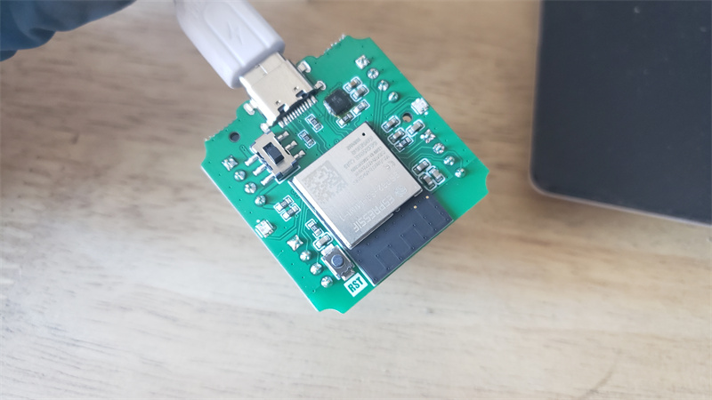

     
    
     

   
    
      

# [MagiClick S3](https://oshwhub.com/kakaka/lao-ban-jian-yi-wei-ke-bian-chen)
[afdian.net](https://afdian.net/a/modular)    [bilibili](https://space.bilibili.com/204526879)

A single-button keyboard, based on ESP32-S3, with a color screen.

CircuitPython is used by default. You can also use MicroPython, Arduino.

- The display part adopts a 0.85-inch color screen, 128x128 resolution, and the display content is delicate
- The main control board is currently only designed with the esp32s3 version, which supports WiFi, flash and RAM large enough to help add more functional scripts
- The overall operation is mainly based on the mechanical axis buttons in the middle, and the left and right sides of the fuselage are generally used as auxiliaries
- The keyboard axis uses a pluggable design, and you can freely choose the silent axis or others
- Built-in a small speaker, listening to a sound is so easy
- An on-board 6-axis motion sensor
- There is an expansion port on the rear side of the fuselage
- USB Type-C interface
- One reset button at the bottom
- On-board colorful LEDs

## Guide

1. Use the Flash Download Tool tool to burn the Combined .bin in the Firmware folder to the board
2. After rebooting, Then copy the firmware_0826.uf2 file to a USB stick
3. After rebooting, copy the contents of the softerware folder to the displayed USB stick

**Settings.toml** : modify your wifi information, know the weather key (need to go to the official website to apply) and city

The main button is used to access the function options

The side button or flip button can exit the current function and return to the home page

## Mechanical

## License

(hardware/mechanical)[Creative Commons — Attribution-NonCommercial-ShareAlike 4.0 International — CC BY-NC-SA 4.0](https://creativecommons.org/licenses/by-nc-sa/4.0/)

## Extra

The most icons is from https://icons8.com/.

Other resource files come from the internet. 

If there are copyright issues involved, please contact me to delete them.
