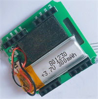

     
    
     

   
    
      

# [MagiClick S3](https://oshwhub.com/kakaka/lao-ban-jian-yi-wei-ke-bian-chen)
[afdian.net](https://afdian.net/a/modular)     |     [bilibili](https://space.bilibili.com/204526879)    |    [Circuitpython](https://circuitpython.org/board/magiclick_s3_n4r2/)     |    [OSHWHUB](https://oshwhub.com/kakaka/lao-ban-jian-yi-wei-ke-bian-chen)

## Supported modules & chips

- ESP32-S3-MINI-1-N4R2
- ESP32-S3-MINI-1-N8
- ESP32-S3FN8

## Hardware 

[Ver 2.3b ](hardware)

## Mechanical

### STL

The latest file for PCB  version 2.0

https://makerworld.com/zh/models/404976#profileId-306794

## Specifications

A single-button keyboard, based on ESP32-S3, with a color screen.

CircuitPython is used by default. You can also use MicroPython, Arduino.

- 0.85-inch color screen, 128x128 resolution
-  esp32-s3, which supports WiFi, flash and RAM large enough to help add more functional scripts
- The overall operation is mainly based on the mechanical axis buttons in the middle, and the left and right sides of the fuselage are generally used as auxiliaries
- The keyboard axis uses a pluggable design, and you can freely choose the silent axis or others
- Built-in a small speaker, listening to a sound is so easy
- An on-board 6-axis motion sensor
- There is an expansion port on the rear side of the fuselage
- USB Type-C interface
- One reset button at the bottom
- On-board colorful LEDs

## Guide

1. Use the Flash Download Tool to burn the Combined .bin in the Firmware folder to the board
2. After rebooting, Then copy the **.uf2** file to a USB stick
3. After rebooting, copy the contents of the softerware folder to the displayed USB stick

 [help](documents/如何下载固件.pdf) 

#### Settings.toml 

modify your wifi information, know the weather key (need to go to the official website to apply) and city

The main button is used to access the function options

The side button or flip button can exit the current function and return to the home page

## How to add new features

Add the .py file to the app folder

## How to contribute

Please use PR to submit contributions

In the **thirdparty** folder, create a project folder according to your own content, the naming needs to be intuitive and easy to understand, and the open source license should be added according to your own wishes

Please add a summary of the contributions in the file **contributer.md**, Add it at the end

## Images

## License

(documents/hardware/mechanical)[Creative Commons — Attribution-NonCommercial-ShareAlike 4.0 International — CC BY-NC-SA 4.0](https://creativecommons.org/licenses/by-nc-sa/4.0/)

## About the Battery

Users can choose the **801230** battery with protection board.

However, choose a battery with safety certification.

Users need to control their own risks.

In the case of non-optimization, the battery will last at least 3 hours and the charging current is currently limited to 100mA.

The battery needs to be soldered to a board containing the MCU.

## Extra

The most icons is from https://icons8.com/.

Other resource files come from the internet. 

If there are copyright issues involved, please contact me to delete them.
