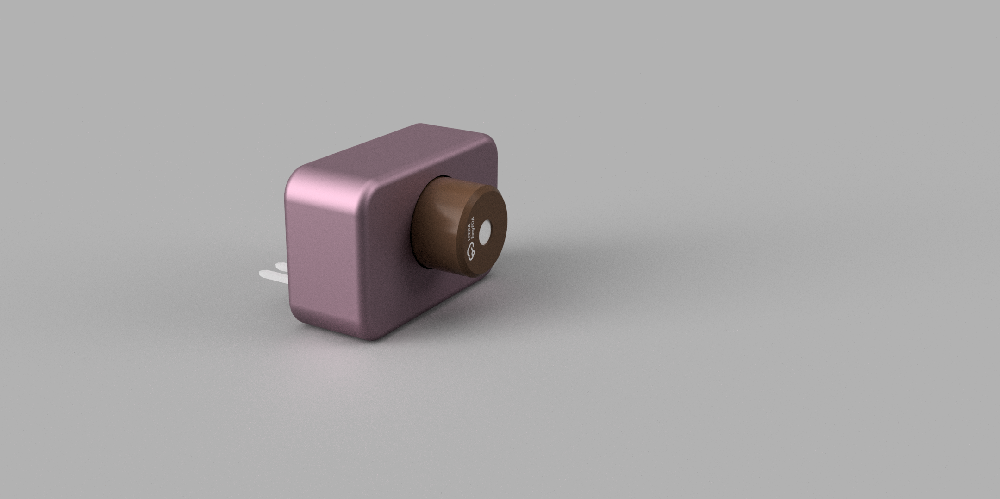
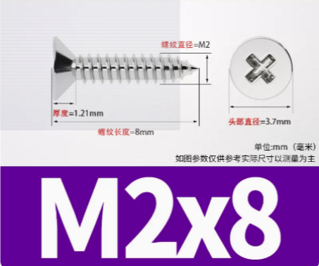

# MLX90640

## BOM

| No.  | Quantity | Designator | Footprint                | Manufacturer Part      | Manufacturer          | Supplier | Supplier Part | Value | Comment                | JLCPCB Part Class |
| ---- | -------- | ---------- | ------------------------ | ---------------------- | --------------------- | -------- | ------------- | ----- | ---------------------- | ----------------- |
| 1    | 1        | C1         | C0603                    | CL10A106KP8NNNC        | SAMSUNG(三星)         | LCSC     | C19702        | 10uF  | 10uF                   | Basic Part        |
| 2    | 1        | C2         | C0603                    | 0603B104K500NT         | FH(风华)              | LCSC     | C30926        | 100nF | 100nF                  | 扩展库            |
| 3    | 1        | U1         | TO-39-4_MELEXIS_MLX90640 | MLX90640ESF-BAB-000-TU | Melexis(比利时迈来芯) | LCSC     | C488251       |       | MLX90640ESF-BAB-000-TU | Extended Part     |
| 4    | 1        | U203       | HDR-TH_8P-P2.54-V-M      | PZ254V-11-08P          | XFCN(兴飞)            | LCSC     | C492407       |       | PZ254V-11-08P          | Extended Part     |

## PCB

1.6mm

## 304不锈钢自攻螺丝十字沉头螺丝

M2*8   2

