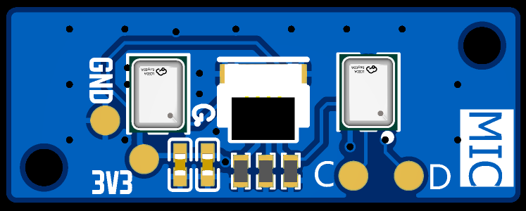
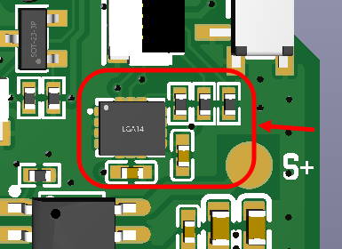

# PDM_MIC

Due to the limitations of the current 2.3 version hardware, in order to use this module, it is necessary to remove the motion sensor and its associated components.

## SUPPORT

- MagiClick 2.3c PCB

## BOM

-  [BOM.xlsx](BOM.xlsx) 
- JS05B-04P-030-3-4

## PCB

thickness: 1.6mm

## GUIDE

Remove the components within the red box.

## images

