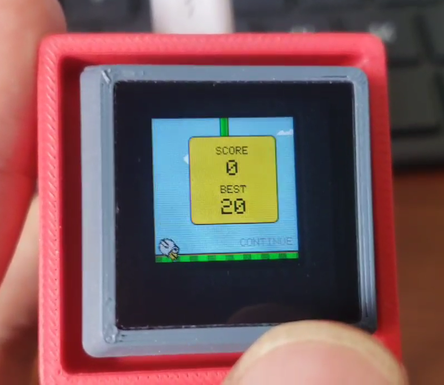

Code ported from [soelvberg/TinyFlap: A Flappy Bird like game for micro controller with 128x128 TFT display. (github.com)](https://github.com/soelvberg/TinyFlap)

Please use [PlatformIO](https://platformio.org/platformio-ide) for compilation and development

Flashing this firmware may overwrite the previous python file, please make a backup

